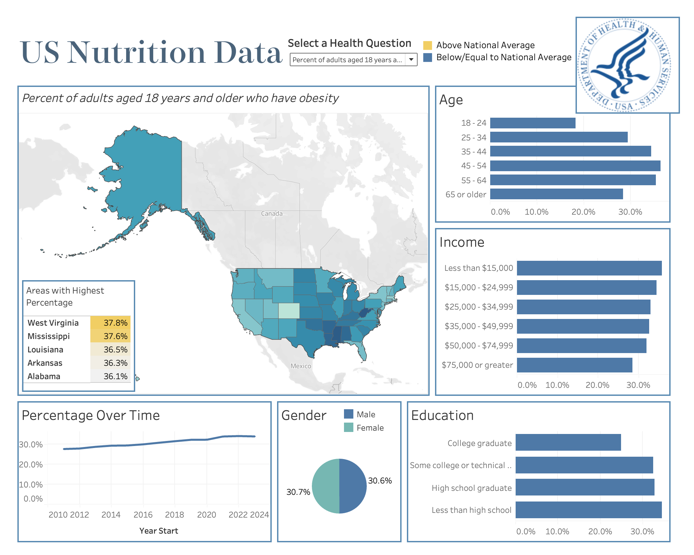
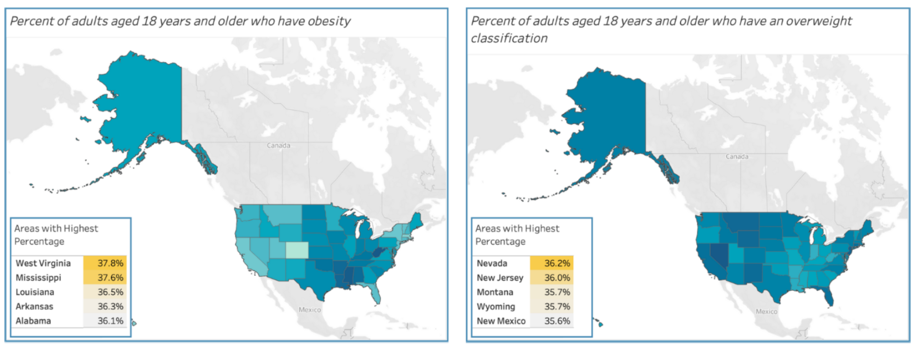
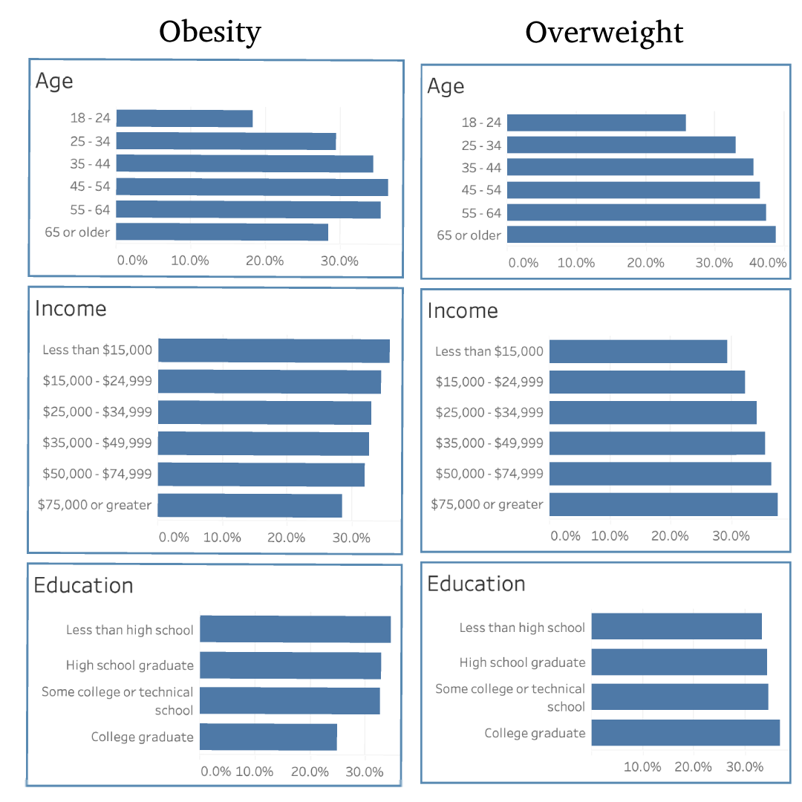

# US-Nutrition-Analysis

## Introduction / Goal

In this project I utilized Tableau and SQL to create visualizations and extract statistics to analyze the relationship between nutrition and features such as location, income, education, age, and gender. The goal of this analysis is to generate recommendations for companies that are tied to health and nutrition, such as gyms, nutrition and supplement retailers, and food vendors. 

- preview of my dashboard posted on Tableau Public: 

## Table of Contents
1. [Data Overview](#data-overview)
2. Executive Overview
3. Analysis
    a. Obesity & Overweight classification
    b. Physical Activeness
    c. Fruit and Vegetable Intake 
4. Application and Recommendations
5. Caveats and Assumptions

## Data Overview

#### Data SourceS
The data used in this analysis was published by the Centers for Disease Control and Prevention and can be found on the united states government's website for data [here](https://catalog.data.gov/dataset/nutrition-physical-activity-and-obesity-behavioral-risk-factor-surveillance-system)

#### Data Structure
The data has a hierarchical structure and has already been processed by the CDC. So, the original raw data which contained a row for every individual has been aggregated for every group. Here is a simple visualization for the hierarchical structure, where for each light blue node at the bottom of the tree there is a unique row in the processed dataset: 

#### Implementation with Tableau 
On the website mentioned in Data Sources, the dataset is packaged as a csv file, and can easily be connected to Tableau as a text file. 

## Executive Overview

## Analysis
In this section I will dive deep into the trends within visualizations and identify statistically significant findings for each health question.

### Obesity & Overweight Classifications
By definition, we differentiate the classification as follows for adults: 
- Overweight: A BMI of 25 to 29.9 
- Obesity: A BMI of 30 or higher

#### Location

Comparing the proportions of people with obesity and overweight classifications in the map below, a couple observations can be made:
- The midwest and southern states have the **highest obesity rates** (insert rate)
- The west and east have **higher overweight rates**
- Obesity and overweight classifications are **inversely proportionate**; that is, areas with high obesity seem to have less overweight people, and areas with low obesity seem to have higher proportions of overweight people. This could be the result of many things; without access to the exact BMI frequencies for each state, it is difficult to make a robust conclusion

#### Age, Income, and Education

- Obesity seems to be **normally distributed** and centered around ages 45-54. The increase from ages 18-45 is  likely due to the slowling of metabolism, and then the decrease from 54 - 65+ is likely because obesity is not manageable once one reaches older ages, urging lifestyle changes or possibly resulting in death.
- On the otherhand, overweight classifications are **positively correlated** with age. This better reflects the result of the slowing of metabolism and physical activities, the main difference being that overweightness is not life threating at older ages. 
- Income and Education are **positively correlated** with overweight classifications, but **negatively correlated** with obesity. It is important to note that Income, Education, and Age are not independent of each other. 

#### Gender
- There are proportionally more overweight men than women (40.4% and 29.5% respectively)
- The percent of men that are obese is equal to the percent of women that are obese (~30% for both)

#### Percentage Over Time
- Overweight classification rates have been constant since 2011
- Obesity has steadily increased by 6.3% since 2011
  

### Muscle-Strengthening Exercise 

### Aerobic Exercise
  

 