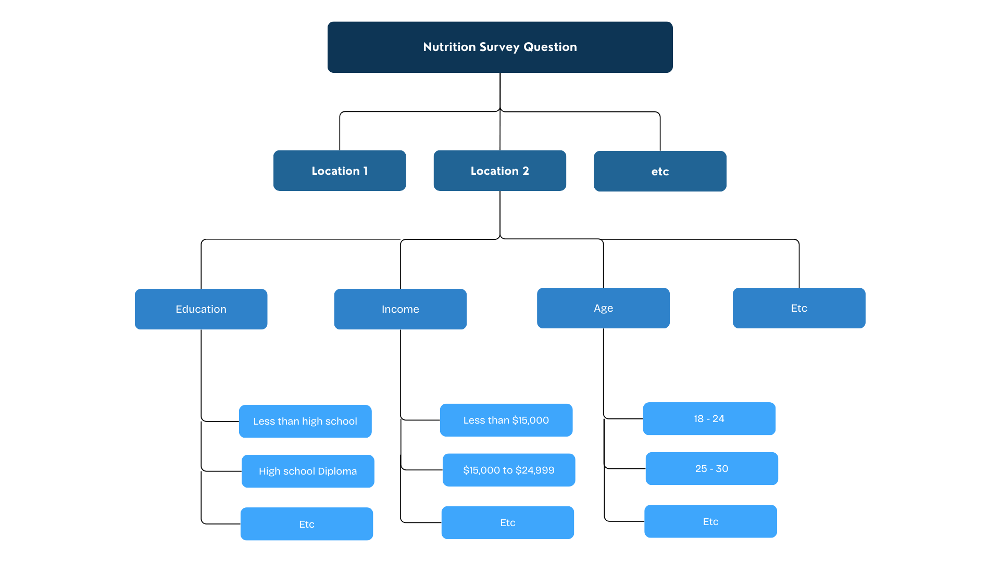

# US-Nutrition-Analysis
(Work in Progress)
## Introduction / Goal

In this project I utilized Tableau and SQL to create visualizations and extract statistics to analyze the relationship between nutrition and features such as location, income, education, age, and gender. The goal of this analysis is to generate recommendations for companies that are tied to health and nutrition, such as gyms, nutrition and supplement retailers, and food vendors. 

- preview of my dashboard posted on Tableau Public

## Table of Contents
1. [Data Overview](#data-overview)
2. [Executive Overview](#executive-overview)
3. [Analysis](#analysis)
    a. [Obesity and Overweight Classifications](#1-obesity-and-overweight-classifications)
    b. [Muscle Strengthening and Aerobic Exercise](#2-muscle-strengthening-and-aerobic-exercise)
    c. [Fruit and Vegetable Intake](#3-fruit-and-vegetable-intake)
4. [Application and Recommendations](#application-and-recommendations)
   a. [Gym and Fitness: Market Segmentation](#1-gym-and-fitness-market_segmentation)
   b.
5. Caveats and Assumptions

## Data Overview

#### Data Sources
The data used in this analysis was published by the Centers for Disease Control and Prevention and can be found on the united states government's website for data [here](https://catalog.data.gov/dataset/nutrition-physical-activity-and-obesity-behavioral-risk-factor-surveillance-system)

#### Data Structure
The data has a hierarchical structure and has already been processed by the CDC. So, the original raw data which contained a row for every individual has been aggregated for every group. Here is a simple visualization for the hierarchical structure, where for each light blue node at the bottom of the tree there is a unique row in the processed dataset: 

#### Implementation with Tableau 
On the website mentioned in Data Sources, the dataset is packaged as a csv file, and can easily be connected to Tableau as a text file. 

## Executive Overview

## Analysis
In this section I will dive deep into the trends within visualizations and identify statistically significant findings for each health question.

### 1. Obesity and Overweight Classifications
By definition, we differentiate the classification as follows for adults: 
- Overweight: A BMI of 25 to 29.9 
- Obesity: A BMI of 30 or higher

#### a. Location

Comparing the proportions of people with obesity and overweight classifications in the map below, a couple observations can be made:
- The midwest and southern states have the **highest obesity rates (avergae of 34.5%, versus national average of 31.1%)**
- The west and east have **higher overweight rates**
- Obesity and overweight classifications are **inversely proportionate**; that is, areas with high obesity seem to have less overweight people, and areas with low obesity seem to have higher proportions of overweight people. This could be the result of many things; without access to the exact BMI frequencies for each state, it is difficult to make a robust conclusion

#### b. Age, Income, and Education

- Obesity with respect to age seems to be **normally distributed** and centered around ages 45-54. The increase from ages 18-45 is  likely due to the slowling of metabolism, and then the decrease from 54 - 65+ is likely because obesity is not manageable once one reaches older ages, urging lifestyle changes or possibly resulting in death.
- On the otherhand, overweight classifications are **positively correlated** with age. This better reflects the result of the slowing of metabolism and physical activities, the main difference being that overweightness is not life threating at older ages. 
- Income and Education are **positively correlated** with overweight classifications, but **negatively correlated** with obesity. It is important to note that Income, Education, and Age are not independent of each other. 

#### c. Gender
- There are **10.9% more overweight men than women** (40.4% and 29.5% respectively)**
- The percent of men that are obese is **equal** to the percent of women that are obese (~30% for both)

#### d. Percentage Over Time
- Overweight classification rates have been **constant** since 2011
- Obesity has steadily **increased** by 6.3% since 2011
  

### 2. Muscle Strengthening and Aerobic Exercise 
The following section will mostly focus on the question which asks if adults partake in muscle-strengthening exercises for 2 or more days a week, but will also look into the question which asks if adults achieve at least 150 minutes a week of moderate-intensity aerobic physical activity or 75 minutes a week of vigorous-intensity aerobic activity (or an equivalent combination). 

#### a. Location

- Western states participate in **significantly more** exercise weekly, **34.5%** of the people engaging in musce building activities and **56.3%** engaging in aerobic activities weekly (versus national averages of 32.5% and  51.4% respectively).
- Obesity and exercise are strongly **negatively correlated** for each state, with a **pearsan coefficient of -0.87** for those who participate in both musclebuilding and  aerobic exerice weekly. 

#### b. Age

- Muscle building exercise is **more popular** for ages 18-24 (46%), but becomes **less prevelant** the older people get (30.3% for ages 24+). 
- Aerobic exercise follows a different trend, having a resurgence of popularity in older age groups 
  
This is likely a combination of the the **values** of each age group. With the popularity of weightlifting on social media, which is dominated by younger groups, appearance and physique is a part of young people's identity and social image, leading to do its prevalence in ages 18-34. On the other hand, aerobic activities are good for cardiovascular health and losing weight, which better fits the needs of older groups  who simply want to improve their health and stay in decent shape. Additionally, weightlifting is more taxing on the body and is more likely to lead to injury, likely causing a decrease in popularity for the older groups.

#### c. Gender
- Muscle Strengthening exercise is **~8% more prevalent** with men than women (36.3% and 28.5% respectively)
- Aerobic exercise is **~3% more prevalent** with men than women (41.6% and 44.8% respectively)
  
Though not a massive difference, the gap can be attributed to the traditional expectations of a man's physical fitness. Interestingly, the gap has remained constant along with the overall increase of popularity in exercise, despite the progressiveness of gender and sex as a whole.

#### d. Percentage Overtime

- Muscle building and aerobic activities have each **increased by 10%** from **2017 - 2023**, likely related to the development of short-form videos on social media with the release of Tik Tok in 2016. 

### 3. Fruit and Vegetable Intake
The following observations pertains to the questions of whether adults consume vetagables or fruit less than one time a day. 
  
#### a. Location
-  An average of 44.3% of the population in southern states (around Oklahoma city, Virginia, Alabama) consumes less than one fruit a day, while the US average is 39.5% 
-  The average of people in the US that consume less than one vegetable a day is 20.1%, with no areas boasting significantly higher numbers
- Vegetable intake is more common than fruit intake by around  20%
- Fruit intake has a **stronger correlation** with weight classifcation and exercise frequency than vegetable intake. With respect to obesity, people who consume fruit less than one time daily yield a coefficient of 0.80 while for people who consume less than one vegetable a day yield a coefficent of 0.30. The other questions yield a similar trend, fruit intake having correlation **coefficients more extreme by around 0.40** on average.

#### b. Age
- Vegetable intake is consistent across most of the age groups, the exception being 18-24 which averages 6% more people that consume less than one a day. This is likely because these young adults are at the beginning of their adult life and have not learned how to properly cook and prepare balanced meals for themselves on a regular basis.  
- Fruit intake is fairly consistent across each age group, with a slight positive trend with age.
  
#### c. Income, Education
- For vegetable intake, education and income are **strongly correlated** (i.e. there is a clear linear trend showcasing that more income/education means proportionately more weekly consumption of vegetables)
- For fruit intake, the correlation is still there, though not as strong
  
One possible reason for this is that lower income individuals are working harder, longer hours in order to compensate for lower wags, resulting in less time for learning to cook and prepare well balanecd meals that involve several ingredients. People with higher incomes are less financially pressured and can either purchase foods directly from vendors or can afford time to learn how to cook and afford the expenses of well planned meals. Fruit on the other hand can be eaten on the fly and has no direct time conflict. 

Another factor could be that higher income/educated individuals have skills and traits that result in a better diet, such as discipline or time management.

## Application and Recommendations
In this section I will provide potential use cases and recommendations utilizing the data and my analysis. To estabilish context, I will frame my advice for hypothetical companies in the following industries: Gym and Fitness, then  Nutrition and Supplements.

### I. Gym and Fitness: Market Segmentation
For a commerical gym, understanding the location and their nutritional demographics is essential for effectively targeting their customer base. Ideally the gym should reach all types of people, but in order to be successful the company should understand the core population that the company will draw from. 

#### a. Intensity-Focused Gyms &rarr; Exercise-Heavy Regions
- A gym that embraces a **brand** centered on **intensity** and toughness would thrive in regions that engage in vigorous aerobic activities and consistent muscle-building routines. For this company I would advise expanding to states like Colorado, Alaska, and Utah which have **high percentages** of people that exercise weekly.
- I would then focus on accumulating equipment and machinery built for hypertrophy and muscle-building, such as free weights, cables, and machines. 
  
  
#### b Influencer-Driven Gyms &rarr; Young, Urban, Aspirational populations
- Gyms partnering with **influencers** often showcase athletic, strong, and aesthetically appealing individuals to align with the aspirations of their target audience. This branding strategy resonates particularly well in urban areas, where an emphasis on appearance and fitness is prevalent, especially among **younger demographics**. For such gyms, I recommend focusing on regions like **California and Florida**, which boast **high exercise participation rates (34.8% and 34.0% respectively)**, particularly within the **younger age groups (50.6% and 47.8% respectively for ages 18-24)**. 
  
#### c. High-End Gyms &rarr; Affluent and Active areas
- For **high-end gyms** focused on an "elite" branding and offering **premium** services and equipment, I would advise expanding to areas with people who want to invest in this exclusivity; for example, some promising states are  **California, Colorado, Vermont, and Oregon**, which average a **high percentage of aerobic and muscle-building exercise**  in the **higher income brackets (average of 54.2% for annual income of $75,000 or greater)**.

#### d. Beginner-Friendly Gyms &rarr; Seeking Lifestyle Changes
- For gyms branding themselves as a place for **beginners**, I would advise looking into areas with **high obesity and overweight classifcations** such as Oklahoma, Mississippi, and Lousiana **(34.5%, 35.5%, and 34.8% respectively)**. These gyms can focus on being "casual" in order to avoid being intimidating, while still attracting a population who may want to improve their health and lifestyle. 
- Additionally, I would suggest focusing on providing equipment and services catered more towards weight-loss and general fitness, e.g. cardio equipment, basketball, tennis, or racketball courts, etc.  
- *Moving Forward:* conduct further research into these populations to see which are most open to improve their nutrition and fitness

### II. Nutrition and Supplements: Product Development, Market Segmentation
Using the populations given above, I will now give advice for companies in the realm of nutrition, food, and supplements.

#### a. Smoothies, Protein Bars, Energy bars &rarr; Exercise-Heavy Regions; Outdoors
- For companies specializing in smoothie mixes and protein/energy bars, I would suggest targeting areas with **high exercise rates** such as California, Colorado, and Utah who often **eat fruit at least once a day (63.7% on average)**. These areas are home to individuals who prioritize fitness and healthy living, which may lead to busy lifestyles, leaving little time to prepare meals or snacks. Positioning these products as convenient, on-the-go solutions for effectively getting nutrients and protein will effectively appeal to this market.

   
#### b. Vegan/Plant Based Desserts &rarr; Areas seeking Substitutes
- For areas such as Oklahoma, Mississippi, Lousiana that have **high obesity and overweight classifications (34.5%, 35.5%, and 34.8% respectively)**, it follows that they have **low rates of vegetables/fruit consumption from their diet (65.4%, 65.1%, and 63.8% versus national average of 68.1%)**. As previously mentioned, there is likely a large subset of this population seeking to make lifestyle changes. To address this, vegan and plant-based companies could focus on creating dessert offerings that serve as a gateway for healthier eating habits, presenting these options as both indulgent and nutritious to encourage adoption.

 

  

 